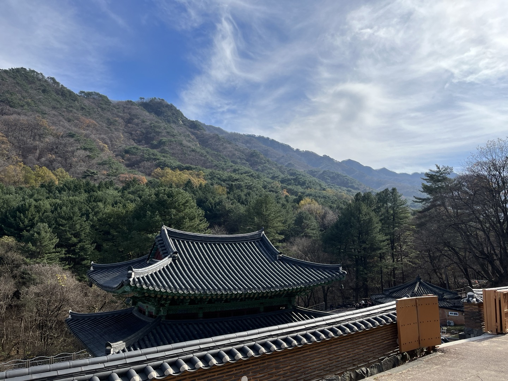
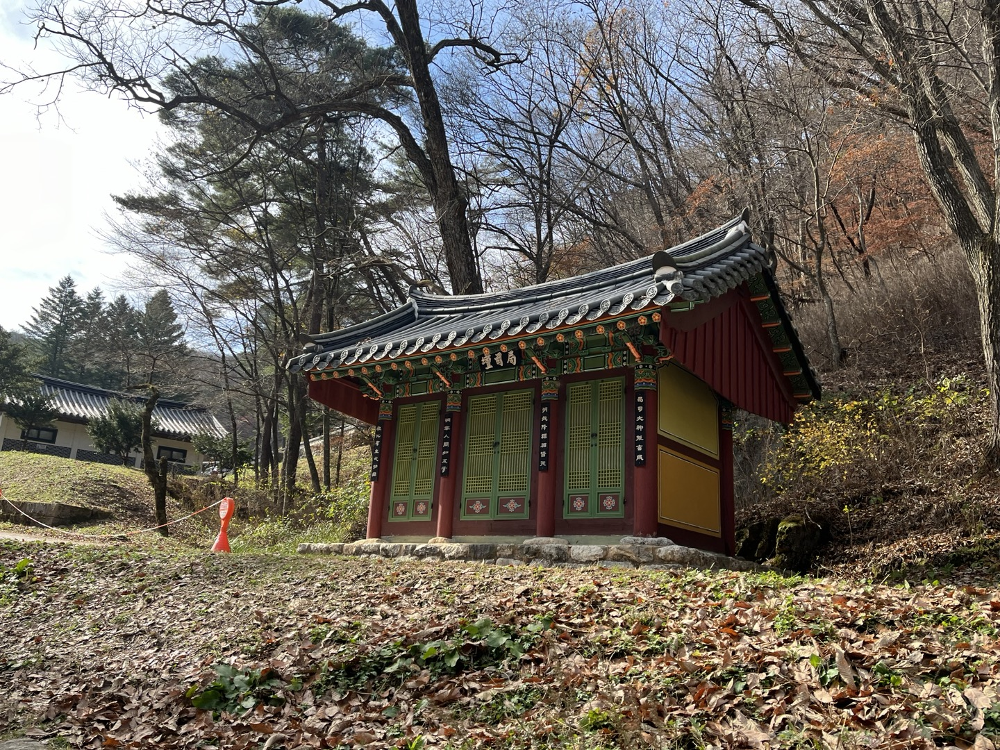

# Kkomi's_Adventure

One Paragraph of project description goes here

## P2GAN
<div style="display: flex; justify-content: center;">
    
    
    
    
</div>

## AnimeGANv2
<div style="display: flex; justify-content: center;">
    
    
    
    
</div>

## Cartoonizer
<div style="display: flex; justify-content: center;">
    
    
    
    
</div>


### Prerequisites

- Windows
- Python 3
- CPU or NVIDIA GPU + CUDA CuDNN

## Getting Started

- Clone this repo:
```
git clone https://github.com/Rabbit-SH/Kkomi-s_Adventure.git
cd Kkomi-s_Adventure
```
### Install requirements

    pip install -r requirements.txt

End with an example of getting some data out of the system or using it for a little demo

## Running the program


    python main.py 


### And coding style tests

Explain what these tests test and why


    Give an example


## Deployment

Add additional notes about how to deploy this on a live system


## Contributing

Please read [CONTRIBUTING.md](https://gist.github.com/PurpleBooth/b24679402957c63ec426) for details on our code of conduct, and the process for submitting pull requests to us.

## Versioning

We use [SemVer](http://semver.org/) for versioning. For the versions available, see the [tags on this repository](https://github.com/your/project/tags). 

## Authors

* **Billie Thompson** - *Initial work* - [PurpleBooth](https://github.com/PurpleBooth)

See also the list of [contributors](https://github.com/your/project/contributors) who participated in this project.

## License

This project is licensed under the MIT License - see the [LICENSE.md](LICENSE.md) file for details

## Acknowledgments
* Code borrows from [AnimeGANv2-pytorch](https://github.com/bryandlee/animegan2-pytorch) and [White-box-Cartoonization](https://github.com/SystemErrorWang/White-box-Cartoonization) and [p2gan](https://github.com/i-evi/p2gan). 
* Hat tip to anyone whose code was used
* Inspiration
* etc
