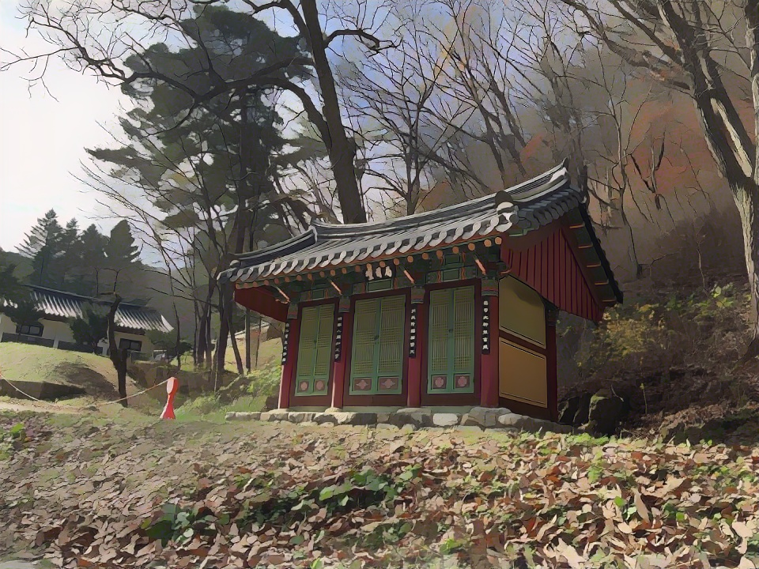

# Kkomi's_Adventure(Watertoad_Course)

This code for the watertoad course of the Chiak Mountain Exploration program of the Korea National Park Service.

## P2GAN
<div style="display: flex; justify-content: center;">
    
    
    
    
</div>

## AnimeGANv2
<div style="display: flex; justify-content: center;">
    
    
    
    
</div>

## Cartoonizer
<div style="display: flex; justify-content: center;">
    
    
    
    
</div>

## For Front-end Developer

Check out the pre-build files here [Kkomi's_Adventure_Front_end](https://github.com/Rabbit-SH/Untact_Exploration)

## Prerequisites

- Windows
- Python 3.7.*
- CPU or NVIDIA GPU + CUDA CuDNN

## Getting Started

- Clone this repo:
```
git clone https://github.com/Rabbit-SH/Kkomi-s_Adventure.git
cd Kkomi-s_Adventure
```
## Install requirements
    
    pip install -r requirements.txt

## Running the Local Server

    uvicorn main:app --reload
    
Then you can test in 127.0.0.1:8000 (localhost)

## How to Use the Back-End

The frontend receives requests through axios and provides API according to get or post requests.


For example in Vue.js request

    "await axios.post('http://localhost:8000/aipainter', formData,{responseType: 'blob'});" =>

In FastApi

Then the function defined under "@app.post("/aipainter")" is executed and the response is sent back to the frontend.


## Datasets

P2GAN
```
@misc{pascal-voc-2007,
    author = "Everingham, M. and Van Gool, L. and Williams, CKI and Winn, J. and Zisserman, A.",
    title = "{PASCAL} {V}isual {O}bject {C}lasses {C}hallenge 2007 {(VOC2007)} {R}esults",
    howpublished = "http://www.pascal-network.org/challenges/VOC/voc2007/workshop/index.html"}
```

## Citations

Sound source : [wholesee](wholesee.com)


## License

This project is licensed under the MIT License - see the [LICENSE.md](LICENSE.md) file for details

## Related Projects
[AnimeGANv2-pytorch](https://github.com/bryandlee/animegan2-pytorch) | [White-box-Cartoonization](https://github.com/SystemErrorWang/White-box-Cartoonization) | [p2gan](https://github.com/i-evi/p2gan). | [Leaflet](https://github.com/Leaflet/Leaflet) | [Vue](https://github.com/vuejs) | [Vuetify](https://github.com/vuetifyjs/vuetify) | [Vuex](https://github.com/vuejs/vuex) | [Openstreetmap](opendatacommons.org)

## Etc

If you have any questions, please contact us

[Rabbit-SH] : 0324suhyun@gmail.com |
[Hyewoong] : n417759@gmail.com | 
[cocoball] : wlrn0514@gmail.com |
[Jinujara] : herjinwo@gmail.com | 
[minjeongKim21] : minddong21@gmail.com


